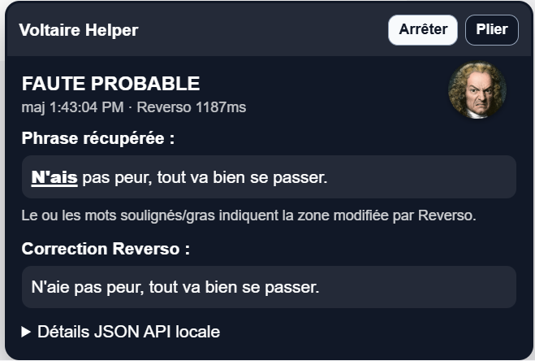
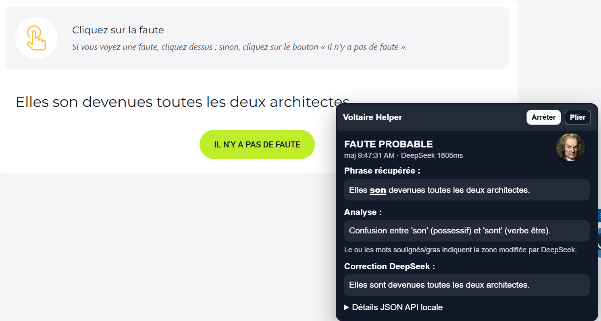

# 🏰 Projet Voltaire Helper

<p align="center">
  
  
</p>

<p align="center">
  
  
</p>

**Un assistant d'entraînement pour Projet Voltaire.** Le script ne clique pas à ta place, il affiche l'analyse pour t'aider à apprendre l'orthographe et la grammaire avant de soumettre ta réponse.

Deux backends au choix :

| Backend | Type | Avantage | Inconvénient |
|---------|------|----------|-------------|
| **koboldcpp** | LLM local | Illimité, privé, rapide | Nécessite un modèle GGUF |
| **Reverso** | API web | Zéro setup | Rate-limité, public |

---

## 🧠 Fonctionnement

```
Page Projet Voltaire → Tampermonkey (extrait la phrase du DOM)
                             ↓
                  Backend local :8765 → koboldcpp ou Reverso
                             ↓
                  Panneau flottant : résultat + correction
```

Le backend écoute sur `localhost:8765` et expose un endpoint `POST /check`. Le userscript Tampermonkey extrait la phrase depuis le DOM React Native Web et l'envoie au backend.

---

## 🚀 Utilisation

### Option 1 — koboldcpp (LLM local, recommandé)

1. **Télécharge [koboldcpp](https://github.com/LostRuins/koboldcpp/releases)**
2. **Télécharge un modèle GGUF** — [`gemma-4-26B-A4B-it-UD-Q4_K_XL.gguf`](https://huggingface.co/unsloth/gemma-4-26B-A4B-it-GGUF/resolve/main/gemma-4-26B-A4B-it-UD-Q4_K_XL.gguf) recommandé (tourne sur un PC portable, ~10 Go RAM)
3. **Lance koboldcpp** avec le modèle de ton choix et l'API activée (flag `--api` en CLI, ou coche « Start Kobold API » dans le launcher)
4. **Lance le backend** (le modèle est auto-détecté, rien à configurer) :

```bat
Backend_Reverso\start_backend_koboldcpp.cmd
```

Si koboldcpp tourne sur un autre port, copie `koboldcpp_config.example.cmd` en `koboldcpp_config.cmd` et change le port.

### Option 2 — Reverso (API web, zéro setup)

```bat
Backend_Reverso\start_backend_reverso.cmd
```

Le backend appelle l'API publique de Reverso. Gratuit mais parfois rate-limité (erreur 429) — attends ~1 minute entre deux vérifications.

### Installer le userscript

1. Ouvre Tampermonkey → **Create a new script**
2. Copie/colle `Tampermonkey/tampermonkey_voltaire_helper.user.js`
3. Sauvegarde
4. Ouvre Projet Voltaire → le panneau apparaît
5. **Démarrer** → analyse la phrase affichée

---

## 📁 Structure

```text
├── Backend_Reverso/
│   ├── voltaire_local_server.py      # Serveur HTTP CORS (dual backend)
│   ├── voltaire_check.py             # Extracteur de phrase + client Reverso
│   ├── voltaire_koboldcpp.py         # Client koboldcpp (API OpenAI-compatible)
│   ├── start_backend_koboldcpp.cmd      # Lancement koboldcpp
│   ├── start_backend_reverso.cmd        # Lancement Reverso
│   ├── koboldcpp_config.example.cmd  # Exemple config koboldcpp
│   ├── test_voltaire_check.py
│   ├── test_voltaire_koboldcpp.py
│   └── test_voltaire_local_server.py
├── Tampermonkey/
│   ├── tampermonkey_voltaire_helper.user.js
│   └── assets/
│       ├── voltaire_happy.png
│       └── voltaire_mad.png
├── Screenshots/
└── .github/workflows/backend-tests.yml
```

---

## ⚙️ Configuration

Tout se passe par variables d'environnement :

| Variable | Défaut | Description |
|----------|--------|-------------|
| `VOLTAIRE_CORRECTOR` | `koboldcpp` | `koboldcpp` ou `reverso` |
| `VOLTAIRE_KOBOLDCPP_BASE_URL` | `http://127.0.0.1:5001` | URL de l'API koboldcpp (le seul truc à changer si besoin) |
| `VOLTAIRE_KOBOLDCPP_TIMEOUT` | `90` | Timeout HTTP en secondes |

---

## ✅ Tests

```bash
cd Backend_Reverso
python -m unittest discover -v
```

CI GitHub Actions : 

---

## 📄 Licence

MIT
